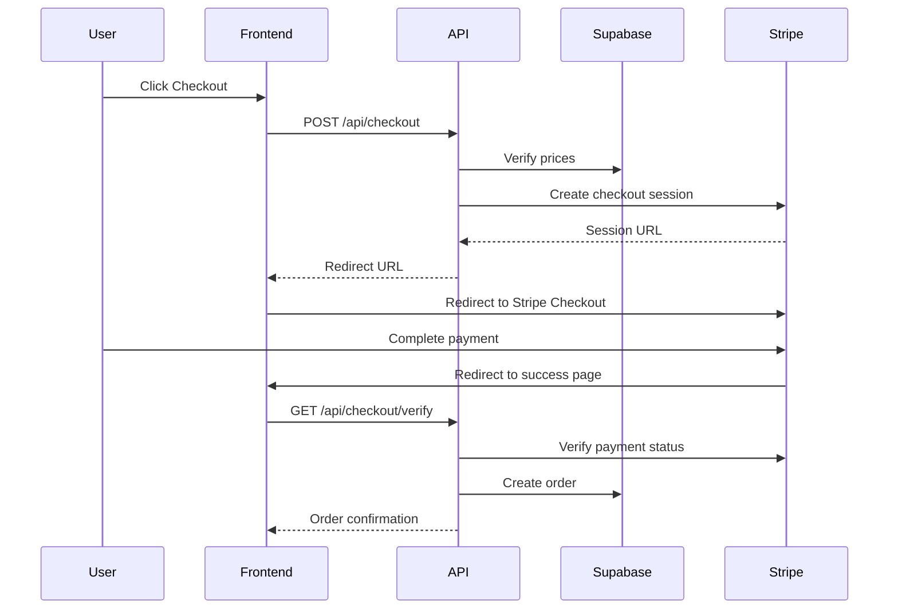

## Overview

Rubik's Vintage uses **Stripe Checkout** for secure payment processing. The implementation includes:

- Server-side checkout session creation
- Price verification from database
- Payment verification and order creation
- Metadata storage for order details
- Idempotent order creation

## Payment Flow



## Stripe Setup

### Environment Variables

```bash
# .env.local
STRIPE_SECRET_KEY=sk_test_51...
NEXT_PUBLIC_APP_URL=http://localhost:3000
```

### Install Stripe SDK

```bash
npm install stripe
```

## Checkout Session Creation

### API Route: POST /api/checkout

**Location:** `app/api/checkout/route.js`

Creates a Stripe checkout session with verified pricing.

```javascript
import Stripe from "stripe";
import { createClient } from "@/utils/supabase/server";
import { NextResponse } from "next/server";

const stripe = new Stripe(process.env.STRIPE_SECRET_KEY);

export async function POST(request) {
  try {
    // 1. Authenticate user
    const supabase = await createClient();
    const { data: { user } } = await supabase.auth.getUser();
    if (!user) {
      return NextResponse.json({ error: "No autenticado" }, { status: 401 });
    }

    // 2. Parse request body
    const { items, customerData } = await request.json();
    if (!items || items.length === 0) {
      return NextResponse.json({ error: "Carrito vacío" }, { status: 400 });
    }

    // 3. Verify prices from database (CRITICAL: never trust client)
    const productIds = items.map((i) => i.id);
    const { data: products, error: dbError } = await supabase
      .from("products")
      .select("id, name, base_price, image_url")
      .in("id", productIds);

    if (dbError) throw dbError;

    // 4. Build Stripe line items with verified prices
    const lineItems = items.map((item) => {
      const product = products.find((p) => p.id === item.id);
      if (!product) throw new Error(`Producto no encontrado: ${item.id}`);
      
      return {
        price_data: {
          currency: "mxn",
          product_data: {
            name: product.name,
            ...(product.image_url && { images: [product.image_url] }),
          },
          unit_amount: Math.round(product.base_price * 100), // Convert to cents
        },
        quantity: item.quantity,
      };
    });

    // 5. Get shipping fee from configuration
    const { data: storeConfig } = await supabase
      .from("store_config")
      .select("shipping_fee")
      .single();

    const shippingFee = storeConfig?.shipping_fee || 0;

    // 6. Create Stripe checkout session
    const session = await stripe.checkout.sessions.create({
      payment_method_types: ["card"],
      line_items: lineItems,
      mode: "payment",
      shipping_options: shippingFee > 0 ? [
        {
          shipping_rate_data: {
            type: "fixed_amount",
            fixed_amount: { amount: shippingFee * 100, currency: "mxn" },
            display_name: "Envío estándar",
          },
        },
      ] : [],
      customer_email: user.email,
      metadata: {
        user_id: user.id,
        customer_name: customerData.fullName,
        customer_phone: customerData.phone,
        shipping_address: customerData.address,
        notes: customerData.notes || "",
        items: JSON.stringify(items.map((i) => ({
          id: i.id,
          quantity: i.quantity,
          unit_price: products.find((p) => p.id === i.id)?.base_price,
        }))),
      },
      success_url: `${process.env.NEXT_PUBLIC_APP_URL}/checkout/success?session_id={CHECKOUT_SESSION_ID}`,
      cancel_url: `${process.env.NEXT_PUBLIC_APP_URL}/checkout`,
    });

    return NextResponse.json({ url: session.url });
  } catch (error) {
    console.error("Stripe error:", error);
    return NextResponse.json({ error: error.message }, { status: 500 });
  }
}
```

### Key Security Features

1. **Price Verification** - Always fetch prices from database
2. **Authentication Required** - User must be logged in
3. **Metadata Storage** - Order details stored in Stripe session
4. **Server-Side Only** - Stripe secret key never exposed to client
5. **Product Validation** - Verify all products exist before creating session

### Request Example

```javascript
const response = await fetch('/api/checkout', {
  method: 'POST',
  headers: { 'Content-Type': 'application/json' },
  body: JSON.stringify({
    items: [
      {
        id: '550e8400-e29b-41d4-a716-446655440000',
        quantity: 2,
        base_price: 599.00 // Ignored - price fetched from DB
      }
    ],
    customerData: {
      fullName: 'Jane Doe',
      phone: '+52 555 123 4567',
      address: 'Calle Example 123, Col. Centro, CDMX, 06000',
      notes: 'Entrega en recepción'
    }
  })
});

const { url } = await response.json();
window.location.href = url; // Redirect to Stripe
```

### Response Example

```json
{
  "url": "https://checkout.stripe.com/c/pay/cs_test_a1b2c3..."
}
```

## Payment Verification

### API Route: GET /api/checkout/verify

**Location:** `app/api/checkout/verify/route.js`

Verifies payment completion and creates order in database.

```javascript
import Stripe from "stripe";
import { createClient } from "@/utils/supabase/server";
import { NextResponse } from "next/server";

const stripe = new Stripe(process.env.STRIPE_SECRET_KEY);

export async function GET(request) {
  try {
    // 1. Extract session_id from query params
    const { searchParams } = new URL(request.url);
    const sessionId = searchParams.get("session_id");
    if (!sessionId) {
      return NextResponse.json({ error: "session_id requerido" }, { status: 400 });
    }

    // 2. Retrieve and verify Stripe session
    const session = await stripe.checkout.sessions.retrieve(sessionId);
    if (session.payment_status !== "paid") {
      return NextResponse.json({ error: "Pago no completado" }, { status: 400 });
    }

    const supabase = await createClient();

    // 3. Check for duplicate orders (idempotency)
    const { data: existing } = await supabase
      .from("orders")
      .select("id")
      .eq("stripe_payment_intent", session.payment_intent)
      .single();

    if (existing) {
      // Return existing order if already created
      return NextResponse.json({
        orderId: existing.id,
        customerName: session.metadata.customer_name,
        total: session.amount_total,
      });
    }

    // 4. Create new order
    const { data: order, error: orderError } = await supabase
      .from("orders")
      .insert([{
        user_id: session.metadata.user_id,
        status: "pagado",
        total_amount: session.amount_total / 100, // Convert from cents
        stripe_payment_intent: session.payment_intent,
        customer_email: session.customer_email,
        customer_name: session.metadata.customer_name,
        shipping_address: session.metadata.shipping_address,
        phone: session.metadata.customer_phone,
        notes: session.metadata.notes,
      }])
      .select()
      .single();

    if (orderError) throw orderError;

    // 5. Create order line items
    const items = JSON.parse(session.metadata.items);
    const itemsToInsert = items.map((item) => ({
      order_id: order.id,
      variant_id: null,
      quantity: item.quantity,
      unit_price: item.unit_price,
    }));

    const { error: itemsError } = await supabase
      .from("item_order")
      .insert(itemsToInsert);

    if (itemsError) throw itemsError;

    // 6. Return order confirmation
    return NextResponse.json({
      orderId: order.id,
      customerName: session.metadata.customer_name,
      total: session.amount_total,
    });
  } catch (error) {
    console.error("Verify error:", error);
    return NextResponse.json({ error: error.message }, { status: 500 });
  }
}
```

### Key Features

1. **Payment Verification** - Confirms payment_status === "paid"
2. **Idempotency** - Prevents duplicate orders on page refresh
3. **Metadata Extraction** - Retrieves order details from Stripe
4. **Order Creation** - Inserts order and line items in Supabase
5. **Error Handling** - Graceful failure with detailed errors

### Request Example

```javascript
const response = await fetch('/api/checkout/verify?session_id=cs_test_a1b2c3...');
const data = await response.json();

console.log(data);
// {
//   orderId: '123e4567-e89b-12d3-a456-426614174000',
//   customerName: 'Jane Doe',
//   total: 129800
// }
```

## Frontend Integration

### Checkout Button Component

```jsx
'use client';
import { useState } from 'react';
import { useCart } from '@/context/CartContext';

export default function CheckoutButton({ customerData }) {
  const { cart } = useCart();
  const [loading, setLoading] = useState(false);
  const [error, setError] = useState(null);

  const handleCheckout = async () => {
    setLoading(true);
    setError(null);

    try {
      const response = await fetch('/api/checkout', {
        method: 'POST',
        headers: { 'Content-Type': 'application/json' },
        body: JSON.stringify({
          items: cart,
          customerData,
        }),
      });

      const data = await response.json();

      if (!response.ok) {
        throw new Error(data.error || 'Error al procesar el pago');
      }

      // Redirect to Stripe Checkout
      window.location.href = data.url;
    } catch (err) {
      setError(err.message);
      setLoading(false);
    }
  };

  return (
    <div>
      {error && <p className="text-red-500">{error}</p>}
      <button
        onClick={handleCheckout}
        disabled={loading || cart.length === 0}
        className="bg-black text-white px-6 py-3 rounded-lg disabled:opacity-50"
      >
        {loading ? 'Procesando...' : 'Pagar con Stripe'}
      </button>
    </div>
  );
}
```

### Success Page

```jsx
'use client';
import { useEffect, useState } from 'react';
import { useSearchParams } from 'next/navigation';
import { useCart } from '@/context/CartContext';

export default function CheckoutSuccess() {
  const searchParams = useSearchParams();
  const sessionId = searchParams.get('session_id');
  const { clearCart } = useCart();
  const [order, setOrder] = useState(null);
  const [loading, setLoading] = useState(true);

  useEffect(() => {
    if (!sessionId) return;

    const verifyPayment = async () => {
      try {
        const response = await fetch(`/api/checkout/verify?session_id=${sessionId}`);
        const data = await response.json();

        if (response.ok) {
          setOrder(data);
          clearCart(); // Clear cart on successful payment
        }
      } catch (error) {
        console.error('Verification error:', error);
      } finally {
        setLoading(false);
      }
    };

    verifyPayment();
  }, [sessionId, clearCart]);

  if (loading) {
    return <div>Verificando pago...</div>;
  }

  if (!order) {
    return <div>Error al verificar el pago</div>;
  }

  return (
    <div className="max-w-2xl mx-auto p-8">
      <h1 className="text-3xl font-bold mb-4">¡Pago exitoso!</h1>
      <p className="mb-2">Gracias por tu compra, {order.customerName}</p>
      <p className="mb-4">ID de pedido: {order.orderId}</p>
      <p className="text-2xl font-bold">Total: ${(order.total / 100).toLocaleString()} MXN</p>
    </div>
  );
}
```

## Database Schema

### Orders Table

```sql
CREATE TABLE orders (
  id UUID PRIMARY KEY DEFAULT gen_random_uuid(),
  user_id UUID REFERENCES auth.users(id),
  status TEXT NOT NULL,
  total_amount DECIMAL(10,2) NOT NULL,
  stripe_payment_intent TEXT UNIQUE,
  customer_email TEXT,
  customer_name TEXT,
  shipping_address TEXT,
  phone TEXT,
  notes TEXT,
  created_at TIMESTAMPTZ DEFAULT NOW()
);
```

### Order Items Table

```sql
CREATE TABLE item_order (
  id UUID PRIMARY KEY DEFAULT gen_random_uuid(),
  order_id UUID REFERENCES orders(id) ON DELETE CASCADE,
  variant_id UUID REFERENCES variants(id),
  quantity INTEGER NOT NULL,
  unit_price DECIMAL(10,2) NOT NULL,
  created_at TIMESTAMPTZ DEFAULT NOW()
);
```

## Testing

### Test Cards (Stripe Test Mode)

```
✅ Success: 4242 4242 4242 4242
❌ Decline: 4000 0000 0000 0002
🔒 3D Secure: 4000 0027 6000 3184
```

Use any future expiration date and any 3-digit CVC.

### Test Checkout Flow

```bash
# 1. Create checkout session
curl -X POST http://localhost:3000/api/checkout \
  -H "Content-Type: application/json" \
  -d '{
    "items": [{"id": "uuid", "quantity": 1}],
    "customerData": {
      "fullName": "Test User",
      "phone": "+52 555 1234",
      "address": "Test Address"
    }
  }'

# 2. Complete payment on Stripe Checkout

# 3. Verify payment
curl http://localhost:3000/api/checkout/verify?session_id=cs_test_...
```

## Error Handling

### Common Errors

| Error | Cause | Solution |
|-------|-------|----------|
| `No autenticado` | User not logged in | Redirect to login |
| `Carrito vacío` | Empty cart | Validate cart before checkout |
| `Producto no encontrado` | Invalid product ID | Verify product exists |
| `Pago no completado` | Payment not confirmed | Wait for Stripe confirmation |

### Client-Side Error Handling

```jsx
try {
  const response = await fetch('/api/checkout', { /* ... */ });
  const data = await response.json();

  if (!response.ok) {
    // Handle API error
    alert(data.error);
    return;
  }

  window.location.href = data.url;
} catch (error) {
  // Handle network error
  console.error('Network error:', error);
  alert('Error de conexión. Intenta de nuevo.');
}
```

## Security Best Practices

1. **Never trust client prices** - Always verify from database
2. **Use server-side only** - Keep Stripe secret key server-side
3. **Validate user authentication** - Require login for checkout
4. **Implement idempotency** - Prevent duplicate orders
5. **Use HTTPS** - Always use SSL in production
6. **Verify webhook signatures** - When using Stripe webhooks (future)

## Next Steps

- [API Routes](/development/api-routes) - API endpoint documentation
- [State Management](/development/state-management) - Cart integration
- [Authentication](/development/authentication) - User auth flow